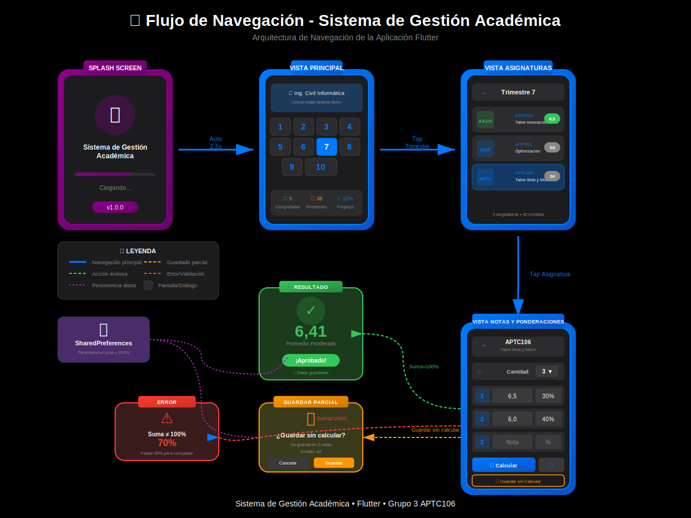
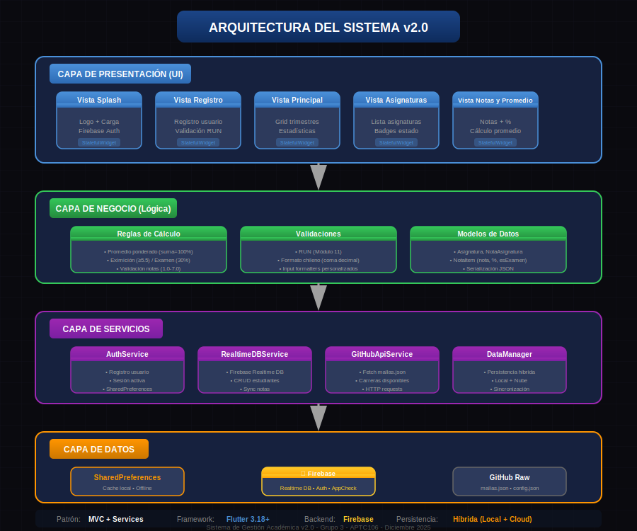

# 📚 Sistema de Gestión Académica - Vesion 2.0

<div align="center">


**Aplicación móvil Flutter para gestión de notas, cálculo de promedios y sincronización académica**

*APTC106 - Taller de Desarrollo Web y Móvil | Grupo 3*

</div>

---
## Video del Funcionamiento de la Aplicación

<div align="center">

[](https://www.youtube.com/watch?v=BQNvytTCMLg)

</div>

## 📖 Descripción

Sistema de Gestión Académica es una aplicación móvil desarrollada en Flutter que permite a los estudiantes de la carrera de Ingeniería Civil Informática Advance de la Universidad Andrés Bello gestionar sus notas de manera eficiente, profesional y sincronizada.

La versión **2.0.0** introduce integración total con la nube y mejoras visuales en el listado de asignaturas.

La aplicación está específicamente diseñada para el sistema académico chileno, implementando:

- 🎯 Escala de notas 1.0 a 7.0 con formato chileno.
- ☁️ **Sincronización en la nube** con Firebase Realtime Database.
- 🔄 **Lógica de Examen:** Cálculo automático de eximición (5.5) y nota mínima de examen (30%).
- 📊 Cálculo de promedios ponderados.
- 💾 Persistencia híbrida (Local + Nube) para acceso offline.

---

## 🎯 Características Principales

### ☁️ Sincronización y Datos
- ✅ **NUEVO:** Sincronización automática de notas entre dispositivos (Firebase).
- ✅ **NUEVO:** Indicador visual de **"X notas guardadas"** en el listado de asignaturas para avances parciales sin promedio calculado.
- ✅ Autenticación segura de usuarios.
- ✅ Persistencia offline con sincronización al recuperar conexión.

### 📊 Gestión Avanzada de Notas
- ✅ Lógica de Examen Unificada:
  - Promedio Presentación < 5.5 → Solicita Examen (30%).
  - Promedio Presentación >= 5.5 → Eximición automática.
- ✅ Calculadora con validación estricta en tiempo real.
- ✅ Guardado parcial de notas y porcentajes.
- ✅ Validación de rangos (notas 1.0-7.0, porcentajes 0-100%).

### 📈 Estadísticas y Seguimiento
- ✅ Dashboard con progreso de carrera (Créditos/Asignaturas).
- ✅ Visualización de estados: Aprobado/Reprobado/Eximido/Pendiente.
- ✅ Navegación fluida entre trimestres.

### 🎨 Diseño y UX
- ✅ Tema oscuro macOS-style optimizado.
- ✅ Feedback visual inmediato (Badges de estado, Alertas de error).
- ✅ 100% responsivo.

---

## 📱 Mockups de la Aplicación

<div align="center">

[](https://jarayaa.github.io/sistema-gestion-academica/mockups_interactivos.html)

</div>

### Flujo de Navegación

<div align="center">



</div>

### Novedades Visuales v2.0.0

#### Listado Inteligente
Ahora, si guardas notas sin calcular el promedio final, la tarjeta de la asignatura mostrará:
> *"4 créditos - **3 notas guardadas**"*

Esto permite identificar rápidamente qué asignaturas tienen datos ingresados pero están incompletas.

---

## 🚀 Instalación

### Prerrequisitos

```bash
- Flutter 3.18.0 o superior
- Dart 3.0.0 o superior
- Cuenta de Firebase configurada (google-services.json)

### Pasos de Instalación

1. **Clonar el repositorio**
```bash
git clone https://github.com/jarayaa/sistema-gestion-academica.git
cd sistema-gestion-academica
```

2. **Configurar Firebase**
```bash
- Colocar google-services.json en android/app/.
- Colocar GoogleService-Info.plist en ios/Runner/.
```

3. **Instalar dependencias**
```bash
flutter pub get
```

4. **Ejecutar la aplicación**
```bash
flutter run
```

---

## 📦 Dependencias

```yaml
dependencies:
  flutter:
    sdk: flutter
  # Firebase Core & Auth
  firebase_core: ^2.24.2
  firebase_app_check: ^0.2.1+8
  
  # Persistencia y Utilidades
  shared_preferences: ^2.5.3
  package_info_plus: ^9.0.0
  cupertino_icons: ^1.0.2
```

---

## 🏗️ Arquitectura

La aplicación sigue el patrón **MVC** (Modelo-Vista-Controlador):

Services Layer: AuthService, RealtimeDBService, GitHubApiService.
Data Layer: DataManager (Maneja sincronización Local-Nube).
Models: NotaAsignatura, Asignatura, NotaItem.
UI Layer: Screens y Widgets reactivos.

<div align="center">



</div>

---

## 🎓 Lógica de Aprobación (v2.0)
La aplicación implementa las reglas de negocio de la universidad:

1.- Nota Aprobación: 3.95 (se redondea a 4.0).
2.- Eximición: Si el promedio de presentación (70%) es >= 5.5, el alumno se exime.
3.- Examen: Si es < 5.5, se habilita el campo "Nota Examen" que vale el 30% restante.
4.- Reprobación Matemática: Si el promedio de presentación es tan bajo que ni con un 7.0 en el examen se alcanza el 3.95, el sistema alerta "Reprobación Inminente".

---

## 📊 Formato de Datos (JSON)

```json
{
  "codigoAsignatura": "IIND303",
  "notas": [
    {"nota": 5.5, "porcentaje": 30.0, "esExamen": false},
    {"nota": 6.2, "porcentaje": 40.0, "esExamen": false},
    {"nota": 4.0, "porcentaje": 30.0, "esExamen": true}
  ],
  "promedioFinal": 5.33,
  "dioExamen": true
}
```
---

## 🧪 Validaciones Implementadas

### Notas
- ✅ Rango: 1.0 - 7.0
- ✅ Formato: Acepta coma y punto decimal
- ✅ Feedback visual inmediato (borde rojo si inválido)

### Porcentajes
- ✅ Rango: 0% - 100%
- ✅ Suma: Debe ser exactamente 100% para calcular
- ✅ Guardado parcial sin completar 100%

### Protección de Datos
- ✅ Advertencia al reducir cantidad de notas
- ✅ Confirmación antes de acciones destructivas
- ✅ Guardado automático tras cálculo

---

## 🔧 Configuración

### Cambiar Nota de Aprobación
```dart
static const double _notaAprobacion = 5.5; // Modificar aquí
```

### Cambiar Cantidad de Notas
```dart
static const int _minNotas = 2;
static const int _maxNotas = 10;
```

---

## 👨‍💻 Autores - Grupo 3

|         Nombre       |              Rol              |
|----------------------|-------------------------------|
| **Jaime Araya**      | Desarrollo Frontend & Backend |
| **Rodrigo Sanhueza** | Diseño UI/UX & Testing        |
| **Sergio Simi**      | Documentación & QA            |

---

📅 Historial de Versiones

**v2.0.0 - 13 Diciembre 2025**

☁️ Sincronización Cloud: Integración completa con Firebase.
✨ UI Mejorada: Indicador de "notas guardadas" en tarjetas de asignatura.
🧮 Lógica Examen: Implementación de ponderación 70/30 y eximición automática.
🐛 Bug Fixes: Corrección de bucles y linter errors (curly_braces_in_flow).
🔒 Seguridad: Firebase App Check activado.

**v1.0.0 - 29 Noviembre 2025**
✅ Lanzamiento inicial.
✅ Calculadora local.
✅ Persistencia básica.

---

## 🔗 Enlaces

- 📁 **Repositorio**: [github.com/jarayaa/sistema-gestion-academica](https://github.com/jarayaa/sistema-gestion-academica)
- 📱 **Video de la Aplicación**: [www.youtube.com](https://youtu.be/BQNvytTCMLg)
- 📖 **Flutter Docs**: [docs.flutter.dev](https://docs.flutter.dev/)
- 🎨 **Material Design 3**: [m3.material.io](https://m3.material.io/)

---

## 📜 Licencia

Este proyecto es de uso académico para estudiantes de la Universidad Andrés Bello.

---

<div align="center">

**APTC106 - Taller de Desarrollo Web y Móvil**

Universidad Andrés Bello | Noviembre 2025

⭐ Si te sirvió este proyecto, dale una estrella en GitHub ⭐

</div>
